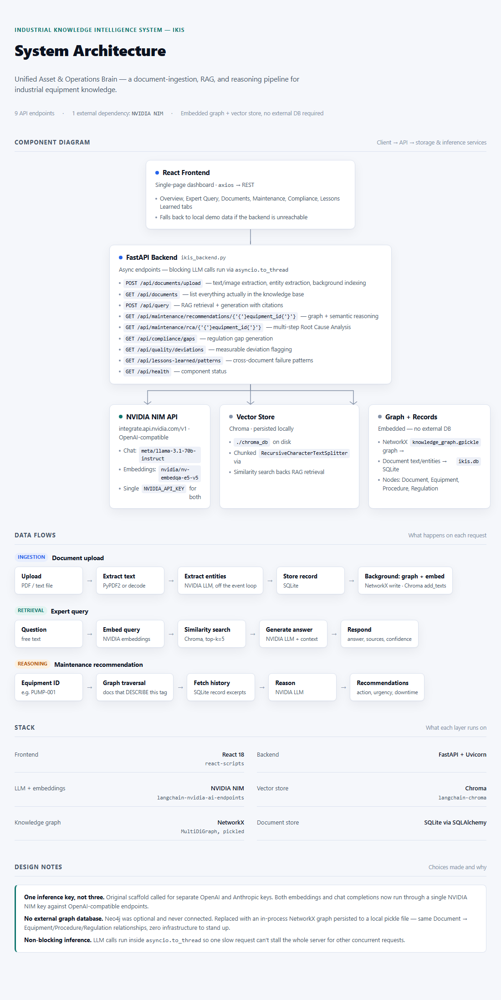

# IKIS — System Architecture

**Industrial Knowledge Intelligence System — Unified Asset & Operations Brain**

This document describes the system as actually built and deployed — no aspirational
components, no placeholders. Every piece named here is running code.

---

## 1. Component Diagram



Text version of the same diagram (for viewers where the image doesn't load):

```
                        ┌─────────────────────────────┐
                        │        React Frontend        │
                        │  (Overview / Expert Query /   │
                        │   Documents / Maintenance /    │
                        │   Compliance / Lessons Learned)│
                        │                               │
                        │  axios --> REST over HTTPS    │
                        └───────────────┬───────────────┘
                                        │
                                        ▼
                        ┌─────────────────────────────┐
                        │       FastAPI Backend        │
                        │      (ikis_backend.py)        │
                        │                               │
                        │  Async endpoints; blocking     │
                        │  LLM calls run via              │
                        │  asyncio.to_thread so one       │
                        │  slow call can't stall the      │
                        │  whole server                    │
                        └─────┬───────────┬─────────────┘
                              │           │             │
              ┌───────────────┘           │             └───────────────┐
              ▼                           ▼                             ▼
   ┌─────────────────────┐   ┌─────────────────────┐   ┌─────────────────────────┐
   │   NVIDIA NIM API      │   │   Vector Store        │   │  Knowledge Graph +       │
   │ integrate.api.nvidia.  │   │   (Chroma)             │   │  Document Store           │
   │ com/v1 — OpenAI-        │   │                       │   │                          │
   │ compatible              │   │  Persisted locally:    │   │  NetworkX MultiDiGraph,    │
   │                        │   │  ./chroma_db           │   │  pickled to disk:          │
   │  Chat:                 │   │                       │   │  ./knowledge_graph.gpickle │
   │  meta/llama-3.1-70b-    │   │  Chunked via            │   │                          │
   │  instruct               │   │  RecursiveCharacter     │   │  Document records in       │
   │                        │   │  TextSplitter           │   │  SQLite: ./ikis.db         │
   │  Vision/OCR:            │   │                       │   │                          │
   │  meta/llama-3.2-11b-    │   │  Backs RAG similarity   │   │  Nodes: Document,          │
   │  vision-instruct         │   │  search                │   │  Equipment, Procedure,     │
   │                        │   │                       │   │  Regulation                │
   │  Embeddings:            │   │                       │   │                          │
   │  nvidia/nv-embedqa-     │   │                       │   │  Edges: DESCRIBES,         │
   │  e5-v5                  │   │                       │   │  CONTAINS, REFERENCES      │
   │                        │   │                       │   │                          │
   │  Single NVIDIA_API_KEY  │   │                       │   │                          │
   │  powers all three        │   │                       │   │                          │
   └─────────────────────┘   └─────────────────────┘   └─────────────────────────┘
```

Everything below the FastAPI layer runs **inside the same backend process** except the
NVIDIA API calls, which are the only external network dependency in the whole system.
There is no separate database server, no separate vector database service, and no
separate graph database — all three are embedded, file-backed, and require zero
additional infrastructure to stand up.

---

## 2. Data Flows

### 2.1 Document ingestion

```
Upload (text / PDF / image)
   │
   ├─ .pdf        → PyPDF2 text extraction
   ├─ image        → NVIDIA vision model transcribes text + infers basic
   │                 diagram relationships (equipment tags, simple flow layout)
   └─ .txt/other   → decoded directly
   │
   ▼
Entity extraction (NVIDIA chat model)
   → equipment tags, procedures, regulations, personnel, dates
   │
   ▼
Store DocumentRecord in SQLite (id, filename, doc_type, content, entities)
   │
   ├─ Background task: add Document + entity nodes/edges to the knowledge graph,
   │  persist to knowledge_graph.gpickle
   │
   └─ Background task: split into chunks, embed, add to Chroma vector store
```

### 2.2 Expert Query (RAG)

```
Question
   │
   ▼
Embed query (NVIDIA embeddings) → similarity_search against Chroma (top-k=5)
   │
   ▼
Retrieved chunks + question → NVIDIA chat model
   → judges whether the retrieved context actually answers the question;
     if not (e.g. a greeting, an unrelated topic), it says so honestly and
     returns confidence 0 instead of forcing an answer out of irrelevant context
   │
   ▼
Answer + cited sources + confidence
```

### 2.3 Maintenance recommendations & Root Cause Analysis

```
Equipment ID (e.g. PUMP-001)
   │
   ├─ Graph traversal: documents that DESCRIBE this equipment tag
   └─ Semantic search fallback: vector similarity search for the equipment ID
      (catches documents where entity extraction used a variant label —
       e.g. "Unit 2" instead of "COMPRESSOR-02" — that the graph would
       otherwise silently miss)
   │
   ▼
Merged document history → NVIDIA chat model
   │
   ├─ Maintenance: 2-3 recommendations (action, urgency, downtime estimate)
   │
   └─ RCA (multi-step): + safety-procedure semantic search
                         + regulation semantic search
                         → synthesis distinguishing immediate cause from
                           root cause, contributing factors, corrective
                           actions, relevant procedures/regulations
```

### 2.4 Compliance gaps & Quality deviations

```
Uploaded documents where doc_type == "regulatory"
   │
   ├─ If any exist: cross-referenced against other uploaded operational
   │  documents → gaps grounded in real uploaded text
   │
   └─ If none exist: falls back to clearly-labeled representative
      scenarios (never presented as if they were real findings)

Uploaded documents where doc_type in (inspection_report, maintenance_log,
equipment_manual)
   │
   ▼
Scanned for explicitly-stated measurable deviations (vibration, temperature,
etc.) from a stated baseline — only reports numbers actually present in the
text, never invented
```

### 2.5 Lessons Learned (failure intelligence)

```
Uploaded documents where doc_type == "incident_report"
   │
   ▼
All records read together (not one at a time) → NVIDIA chat model instructed
to find patterns supported by AT LEAST TWO documents — a genuine
cross-document systemic issue, not a restatement of one incident
   │
   ▼
Pattern + risk level + affected equipment + supporting doc IDs +
recommended proactive action
```

---

## 3. Stack

| Layer | Technology |
|---|---|
| Frontend | React 18 (react-scripts) |
| Backend | FastAPI + Uvicorn |
| LLM (chat/reasoning) | NVIDIA NIM — `meta/llama-3.1-70b-instruct` |
| LLM (vision/OCR) | NVIDIA NIM — `meta/llama-3.2-11b-vision-instruct` |
| Embeddings | NVIDIA NIM — `nvidia/nv-embedqa-e5-v5` |
| Vector store | Chroma (`langchain-chroma`), persisted to local disk |
| Knowledge graph | NetworkX `MultiDiGraph`, pickled to local disk |
| Document store | SQLite via SQLAlchemy |
| Deployment | Render (Blueprint: one `render.yaml` for both services) |

---

## 4. Engineering Decisions & Why

**One inference key, not three.** An earlier draft of this backend called for separate
OpenAI and Anthropic keys (one for embeddings, one for chat). Both now run through a
single NVIDIA NIM key against OpenAI-compatible endpoints — one credential, two
capabilities, nothing left half-configured.

**No external graph database.** Neo4j was in an earlier draft but never actually
connected. Replaced with an in-process NetworkX graph persisted to a local pickle file:
same Document → Equipment/Procedure/Regulation relationships, zero infrastructure to
provision, run, or pay for.

**Non-blocking inference.** Every LLM call runs inside `asyncio.to_thread` so a slow
request (NVIDIA's free tier can take 30-140+ seconds under load) can't stall the whole
server for other concurrent requests. Verified directly: the `/api/health` endpoint
stays responsive while a slow query is in flight elsewhere.

**Semantic fallback for equipment history.** Knowledge-graph traversal is exact-match
on whatever label the entity-extraction LLM assigned. If it tags a document under a
variant label (a real, observed case: "Unit 2" instead of "COMPRESSOR-02"),
Maintenance/RCA would silently miss it even though RAG finds it fine via embeddings.
`_get_equipment_history` now merges both retrieval paths so Maintenance/RCA see what
RAG sees.

**Deliberately dishonest never.** Compliance gaps, quality deviations, and RAG answers
all explicitly label themselves when they're falling back to a representative/demo
scenario rather than grounded evidence — the system never presents a guess as a fact.

---

## 5. Known Gaps (stated plainly, not glossed over)

- **True P&ID schematic computer vision is not implemented.** What does work, tested
  directly: the vision model reads equipment tags and infers *basic* flow relationships
  from a simple diagram layout (e.g. `TANK-101 → PUMP-001 → VLV-201 → TANK-102`) — real
  partial diagram-structure understanding, not just OCR, but unvalidated against dense,
  real industry-standard drawings with ISA symbol libraries and instrument bubbles.
- **No QMS system integration.** No specific target system was named in scope. What's
  built instead — quality-deviation flagging from uploaded records — covers the
  "flagging quality deviations" language from the brief without a specific external
  system to integrate against.
- **No persistent storage on the free-tier deployment.** SQLite, Chroma, and the
  knowledge graph are plain files on the container's local disk. Render's free web
  services have no persistent disk, so a redeploy wipes all previously uploaded
  documents. Real persistence needs a paid Render Persistent Disk (or a managed
  database) — not configured here to keep the deployment free.
- **NVIDIA free-tier rate limiting** is the actual scalability bottleneck under
  sustained load (documented with real numbers in `ikis-backend/BENCHMARK_RESULTS.md`),
  not the application code, which was separately verified to stay responsive to other
  requests while a slow call is in flight.
- **Benchmark is automated (keyword/content match) across 12 checks**, not a
  large domain-expert-graded suite.

---

*IKIS — Industrial Knowledge Intelligence System · ET AI Hackathon 2026*
